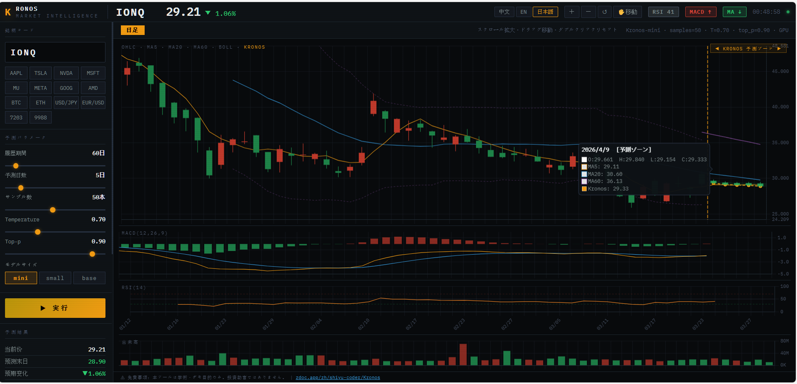
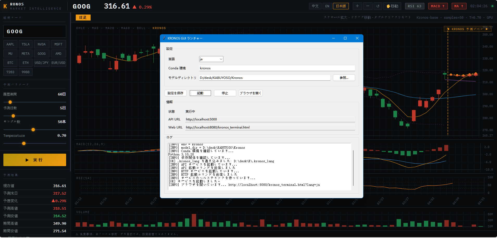

# KRONOS Market Intelligence — 成果物説明文

---

## 名称

**KRONOS Market Intelligence**

株式・為替市場向けの AI 時系列予測システム。
Transformer ベースの時系列基盤モデル「Kronos」を用いて、ローソク足（OHLCV）の将来値を確率的にサンプリング予測し、インタラクティブなチャート UI でリアルタイムに可視化する。

---

## 使用技術

### バックエンド
| 技術 | 用途 |
|---|---|
| Python 3.10+ | 全バックエンド実装言語 |
| Flask 3.x | REST API サーバー（`/api/predict` 等） |
| Flask-CORS | CORS 全開放（ローカルフロントとの通信） |
| PyTorch (CUDA / MPS / CPU) | Kronos モデル推論エンジン |
| yfinance | Yahoo Finance からの OHLCV データ取得 |
| pandas / numpy | データ前処理・技術指標演算 |
| Miniconda / Anaconda | 仮想環境管理 |

### フロントエンド
| 技術 | 用途 |
|---|---|
| HTML5 / CSS3 / Vanilla JS | メインチャート UI（`kronos_terminal.html`） |
| Canvas API | ローソク足・インジケーター描画 |
| Python `http.server` | 静的ファイル配信（ローカル HTTP サーバー） |

### GUI ランチャー
| 技術 | 用途 |
|---|---|
| Python tkinter / ttk | デスクトップ GUI（`kronos_launcher.py`） |
| subprocess | conda 環境・サーバープロセス管理 |
| urllib | IPv4 / IPv6 デュアルスタック ヘルスチェック |

### CLI 予測ツール
| 技術 | 用途 |
|---|---|
| matplotlib / gridspec | K 線・MACD・RSI・出来高チャート描画 |
| argparse | CLI パラメーター解析 |

### AI モデル
| 項目 | 内容 |
|---|---|
| モデル名 | Kronos-mini / Kronos-small / Kronos-base |
| 配布元 | [zdoc.app/zh/shiyu-coder/Kronos](https://www.zdoc.app/zh/shiyu-coder/Kronos) |
| アーキテクチャ | Transformer 系 時系列基盤モデル |
| 推論方式 | 確率的サンプリング（temperature / top-p） |

---

## 開発人数・役割

| 人数 | 役割 |
|---|---|
| 1名 | 全工程（設計・実装・デバッグ・UI/UX）を単独で担当 |

---

## 開発期間

| | 日付 |
|---|---|
| 開始 | 2025年（詳細月日非公開） |
| 終了 | 2026年4月9日 |

---

## 開発の目的・意図

### 背景
市場で公開されている Kronos 時系列基盤モデルは、CLI や Jupyter Notebook での利用が前提となっており、**一般ユーザーが手軽に使える GUI・Web インターフェースが存在しなかった**。

### 目的
1. **ノーコードで使えるデスクトップ起動環境の構築**
   — conda 環境の管理・依存関係インストール・サーバー起動を GUI 1クリックで完結させる

2. **リアルタイムインタラクティブチャートの実装**
   — ローソク足・MA・ボリンジャーバンド・MACD・RSI・出来高をブラウザ上で統合表示

3. **多言語対応（中国語・英語・日本語）**
   — 国際的な利用を想定し、UI・ログを 3 言語で完全対応

4. **ローカル完結型のプライバシー保護設計**
   — モデル推論・データ取得をすべてローカルで完結させ、外部サーバーへの依存を最小化

---

## 開発した過程で努力した点

### 1. IPv4 / IPv6 デュアルスタック対応
Windows 環境では `localhost` の DNS 解決が IPv6（`::1`）に解決されるケースがあり、サーバーが `127.0.0.1` のみをリッスンしていると接続失敗が発生する問題を発見・修正した。
- サーバー側：`--host 0.0.0.0` でデュアルスタック監視
- ヘルスチェック側：`127.0.0.1` と `[::1]` を両方試行し、どちらか通れば成功とする設計に変更

### 2. ヘルスチェックのタイムアウト設計
conda 環境の初回起動には数秒〜十数秒かかるため、当初の **3 秒タイムアウト**では頻繁に「起動失敗」と誤判定された。
- **60 秒**のタイムアウト、**3 秒**のプロセス予熱待機、2 秒間隔でのリトライ、リアルタイムのログ表示（残り秒数・api/web 各ステータス表示）を実装し、起動安定性を大幅改善

### 3. conda 実行ファイルの自動検出
Miniconda / Anaconda のインストールパスが環境によって異なるため（C ドライブ・D ドライブ・ユーザーホーム等）、複数パスの候補走査 + `where conda` コマンドによるフォールバック検出を実装した。

### 4. キャンドルスティック描画エンジンの自作
既存チャートライブラリを使わず、Canvas API でローソク足・影線・MA ライン・ボリンジャーバンド・MACD バー・RSI ラインをゼロから実装。
ドラッグ移動・スクロール拡縮・ダブルクリックリセット・ホバー時 OHLC ツールチップなど、プロ仕様のインタラクションを実現した。

### 5. 影線の過剰伸長の抑制
Kronos モデルが出力する高値・安値がボディに対して非現実的に長くなる場合があるため、**過去の実績ヒゲ比率の中央値**から上限を計算し、予測ローソクの影線を自動クリッピングする処理を実装した。

### 6. モデルディレクトリと実行ファイルの分離設計
従来の実装ではスクリプトと同じディレクトリにモデルを置く必要があったが、`--model-dir` オプションを追加し、実行環境とモデル資産を完全に分離できる設計に変更した。

---

## 動作確認済み環境

### ハードウェア・OS
| 項目 | 内容 |
|---|---|
| OS | Windows（WDDM モード） |
| GPU | NVIDIA GeForce RTX 5070 Ti |
| VRAM | 16,303 MiB（約 16 GB） |
| CUDA Driver | 591.74 |
| CUDA Version | 13.1 |

### Python 環境（conda 仮想環境名：`kronos`）
| パッケージ | バージョン | 用途 |
|---|---|---|
| Python | 3.10 | 実行環境 |
| torch | 2.11.0+cu128 | GPU 推論（CUDA 12.8） |
| torchaudio | 2.11.0+cu128 | PyTorch 依存 |
| torchvision | 0.26.0+cu128 | PyTorch 依存 |
| Flask | 3.1.3 | REST API サーバー |
| flask-cors | 6.0.2 | CORS 対応 |
| yfinance | 1.2.0 | 株価データ取得 |
| pandas | 2.2.2 | データ処理 |
| numpy | 1.26.4 | 数値演算 |
| matplotlib | 3.9.3 | CLI チャート描画 |
| huggingface-hub | 0.33.1 | モデルダウンロード |
| safetensors | 0.6.2 | モデルファイル読み込み |
| einops | 0.8.1 | Tensor 操作 |
| curl_cffi | 0.13.0 | yfinance 依存 |
| tqdm | 4.67.1 | 進捗表示 |

> 完全なパッケージリストは `environment.txt` を参照。

---

## 成果物構成ファイル一覧

| ファイル名 | 役割 |
|---|---|
| `kronos_launcher.py` | GUI ランチャー（tkinter）。conda 環境管理・サーバー起動・ヘルスチェック |
| `kronos_server.py` | Flask REST API サーバー。`/api/predict` `/api/health` `/api/config` `/api/quote` |
| `kronos_terminal.html` | ブラウザ上のインタラクティブチャート UI（フルスクリーン対応） |
| `kronos_predictor.py` | CLI 版予測ツール。matplotlib による K 線・インジケーター描画 |
| `kronos_config.ini` | 設定ファイル（conda 環境名・モデルディレクトリ・言語） |
| `.kronos_lang` | 起動時言語引き渡し用ファイル（GUI → HTML） |
| `environment.txt` | 動作確認済み Python 環境パッケージ一覧（`pip list` 出力） |

---

## スクリーンショット

### チャート画面（日本語モード）
予測ゾーンを点線区切りで表示。ホバーで OHLC・MA・Kronos 予測値を確認可能。

### GUI ランチャー
conda 環境・モデルディレクトリを設定し「起動」ボタン 1 つでサービスを起動。ログパネルでリアルタイム状態を確認できる。

---

## GitHub リポジトリ

> リポジトリ公開後、以下にURLを記載：
> `https://github.com/（ユーザー名）/（リポジトリ名）`

---

*本説明文は 2026年4月9日 時点の成果物に基づいて作成。*
